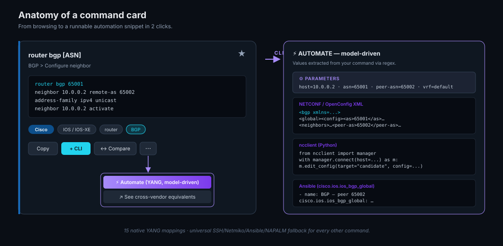

# Architecture

> How 7 vendor sources turn into 9,808 searchable, automatable commands in a
> single static HTML file.


---

## TL;DR

- **3 vendors, 5 OS, 26 categories, 9,808 commands** — Cisco (IOS / IOS-XE / NX-OS / ASA), Juniper (Junos), Arista (EOS).
- **Reproducible Python pipeline** — every command can be traced back to a published source via a stdlib-only parser in `scripts/`.
- **Single static file** — `index.html` is ~190 KB of vanilla JS + a `fetch('commands.json')`. No framework. No build step for the UI. Hosted on GitHub Pages.
- **Zero credentials on disk** — automation snippets use `${conn().host}` interpolations driven by a sessionStorage-only connection state with a redact toggle for safe screenshots.

---

## Data pipeline (3 stages)

### 1 · Vendor sources (`scripts/sources/*.md`)

All public publications, dropped in as raw markdown. Each vendor has 1–3 books:

| Vendor | Sources | Output |
|---|---|---|
| **Cisco** | ENCOR / ENARSI Portable CG · ASA 9.24 CLI Reference (Books 1–3) · IOS OSPF Command Reference · VXLAN BGP EVPN NX-OS Reference | 3,933 |
| **Juniper** | Junos OS CLI Reference (2025) · Day One: Beginner's Guide · Day One: Exploring the Junos CLI 2e | 3,007 |
| **Arista** | EOS User Guide v4.36.0F (official) | 2,868 |
| **Community** | grplyler · r7perezyera · hyprblaze · cmdref.net · INSRapperswil · NX-OS gist · curated seed | merged in |

The `scripts/sources/` folder is `.gitignored` — only the resulting JSON is checked in, so the repo stays a manageable size.

### 2 · Parsers (`scripts/parse_*.py`)

One parser per source format. All are pure Python 3 stdlib — no dependencies, no virtualenv, runs anywhere.

| Parser | Source format | Output |
|---|---|---|
| `parse_encor.py` | Cisco Press chapter+verb regex | `encor.json` |
| `parse_junos.py` | Day-One style + alphabetical CLI Reference index (two modes) | `junos.json` |
| `parse_arista.py` | Bold-backtick + fenced code + blockquote (`**\`name\`** *\`mode\`*`) | `arista.json` |
| `parse_cisco_ospf.py` | Same bold-backtick format, OSPF-locked category | `cisco_ospf.json` |
| `parse_cisco_extras.py` | ASA 9.24 + NX-OS VXLAN/EVPN, word-boundary role classifier | `cisco_asa.json` · `cisco_nxos_vxlan.json` |
| `parse.py` | Master merger — generic walker for community markdown + merges all JSONs above + global dedupe by normalized cmd | **`commands.json`** |

Categorization is deterministic — chapter title → default category, then keyword overrides (BGP / OSPF / VXLAN / EVPN / …) with word-boundary patterns so `EVPN` doesn't accidentally match `vpn`. Role assignment is clamped per source (Nexus is fabric — never `firewall`).

### 3 · `commands.json`

Single source of truth. ~3.0 MB. Each row is:

```json
{
  "os":     "ios",       // ios | iosxe | nxos | asa | junos | eos
  "role":   "router",    // router | switch | firewall
  "vendor": "Cisco",     // Cisco | Juniper | Arista
  "cat":    "BGP",
  "title":  "router bgp [ASN]",
  "cmd":    "router bgp 65001\n neighbor 10.0.0.2 remote-as 65002",
  "desc":   "BGP > Configure neighbor"
}
```

The UI fetches this once at boot with `cache:'no-cache'` and works entirely client-side from there. No backend.

---

## UI architecture (`index.html`)



### Render pipeline

```
state            DATA (9,808)
  ├ filters   ┐    │
  ├ search    ┼───►│  matches(d) → filtered[]
  └ q-tokens  ┘    │
                   ├─► renderCards(filtered, $results)
                   ├─► renderTable(filtered, $results)
                   └─► renderCompare(filtered, $results)
```

- **DOM-safe rendering** — all dynamic content goes through `el(tag, attrs, ...kids)` and `replaceChildren()`. No `innerHTML` with untrusted strings.
- **Concept-aligned Compare view** — `conceptKey(d)` normalizes titles into stable slugs (`bgp:peer`, `ospf:auth`, …) so Cisco's `neighbor` row lines up horizontally with Junos's `peer` row and Arista's `neighbor` row.
- **Deep-link state** — current vendor / OS / role / cat / search / view / CLI Builder queue is serialized into a base64 `?ws=…` URL param. Sharing the URL recreates exactly what you saw.
- **Persistence** — favorites, recent, CLI queue, sidebar collapse, theme all live in `localStorage`. Connection params live in `sessionStorage` so they don't outlive the tab.

### Automate drawer

Two flavors per card:

1. **`⚡ Automate (YANG)`** — model-driven. 15 patterns are mapped end-to-end:
   - `extract(cmd)` regex pulls values (IP, ASN, VLAN, interface name, …)
   - `render(vendor, vals)` returns vendor-correct NETCONF XML + ncclient Python + Ansible task pre-filled with your values
   - Patterns: iface-ipv4, static-route, ospf-network, bgp-neighbor, vlan, switchport-access, ntp-server, syslog-host, hostname, interface-desc, loopback, default-route, trunk-port, aaa-radius, portchannel

2. **`🔧 Automate (SSH)`** — universal fallback. Every command, every vendor:
   - Netmiko Python snippet with the correct `device_type`
   - Ansible task with `cisco.ios.ios_command` / `junipernetworks.junos.junos_command` / `arista.eos.eos_command`
   - NAPALM `load_merge_candidate` + `commit_config` + `discard_config`

Both drawers render live — typing into the floating parameter editor (Host, User, Password, Port) re-renders every snippet immediately. The Password field redacts on toggle for safe screenshots.

### Parse Output modal

Six built-in `show`-command parsers (Cisco BGP summary, IP route, Interface brief, OSPF neighbor, Junos BGP summary, Junos route terse) using TextFSM-equivalent regex. Auto-detects format from input. Exports the structured table as CSV.

---

## Hosting

```
push to main
  └─► GitHub Actions: gh-pages (built-in)
       └─► https://gesh75.github.io/multivendor-cli-configurator/
```

`index.html` + `commands.json` is the entire deployment. ~190 KB + 3 MB. No build, no CDN, no API.

---

## Repo layout

```
multivendor-cli-configurator/
├── index.html               # the entire UI — vanilla JS, no framework
├── configurator.html        # legacy form-based generator (archived)
├── commands.json            # single source of truth (~3 MB, 9,808 rows)
├── README.md
├── ARCHITECTURE.md          # you are here
├── docs/
│   └── img/
│       ├── architecture.svg
│       └── card-anatomy.svg
└── scripts/
    ├── parse.py             # master merger
    ├── parse_encor.py
    ├── parse_junos.py
    ├── parse_arista.py
    ├── parse_cisco_ospf.py
    ├── parse_cisco_extras.py
    ├── seed.json            # hand-curated 187 entries
    ├── encor.json           # intermediate per-source JSON
    ├── junos.json
    ├── arista.json
    ├── cisco_ospf.json
    ├── cisco_asa.json
    ├── cisco_nxos_vxlan.json
    └── external_merged.json # prior 9,802-entry curated dataset (deduped)
```

---

## Regenerating `commands.json`

```bash
cd scripts
# 1. Drop new markdown sources into scripts/sources/
# 2. Run per-source parsers (each is idempotent)
python3 parse_encor.py
python3 parse_junos.py
python3 parse_arista.py
python3 parse_cisco_ospf.py
python3 parse_cisco_extras.py
# 3. Master merge — dedupes against all per-source JSONs + community markdown + seed
python3 parse.py
# Output: ../commands.json
```

Total wall time: ~6 seconds. No dependencies to install.
