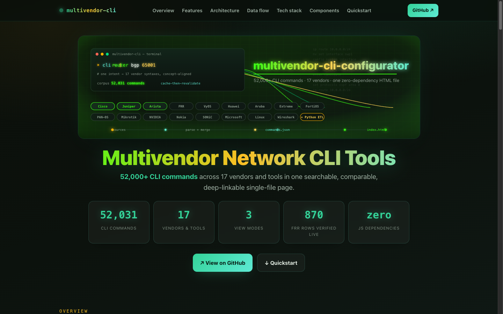
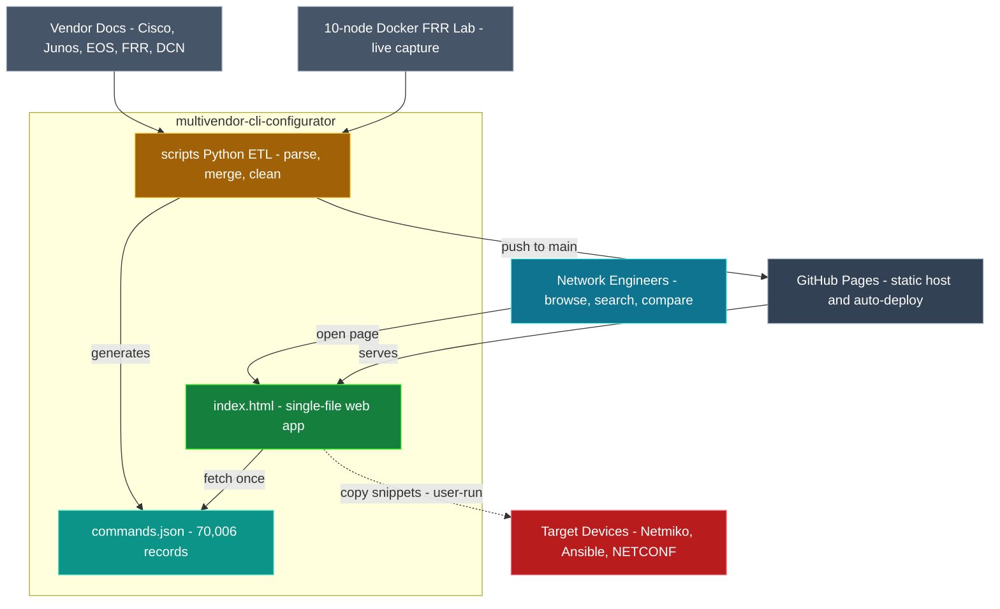

<p align="center">
  
</p>

# Multivendor Network CLI Tools

## 📖 Live documentation

[](https://gesh75.github.io/multivendor-cli-configurator/docs/)

> 🌐 **Live:** <https://gesh75.github.io/multivendor-cli-configurator/docs/> — an animated single-page guide: architecture diagrams, data flow, tech stack, and quickstart.
>
> 🗂️ Part of the **[gesh75 documentation hub](https://gesh75.github.io/)** — all my network & AI engineering project docs in one place.


> A zero-dependency single-file HTML reference for network engineers —
> **70,000+ CLI commands across 17 vendors & tools** in one searchable,
> comparable, shareable, deep-linkable interface.

🟢 **Live demo:** [gesh75.github.io/multivendor-cli-configurator](https://gesh75.github.io/multivendor-cli-configurator/)
📐 **Architecture:** [docs/ARCHITECTURE.md](docs/ARCHITECTURE.md)
🛠️ **Develop / ops:** [docs/DEVELOP.md](docs/DEVELOP.md)



---

## What's here

**[Cheatsheet](https://gesh75.github.io/multivendor-cli-configurator/)** (`index.html`) —
**70,006 commands** across **17 vendors & tools**, searchable, filterable,
deep-linkable, with three view modes:

- **Cards** (default) — auto-fit grid grouped by category
- **Table** — sortable, exportable to CSV / Markdown / JSON / TXT
- **Compare** — row-aligned, concept-aligned side-by-side matrix. N-vendor
  aware: defaults to the four with deepest coverage (Cisco · Juniper · Arista ·
  FRR) and you filter to any subset of the 17. The view is paginated and
  virtualized so it stays fast even across the full corpus.

Each command card has:
- **Copy / + CLI / See equivalents ↗** — usual operations
- **🔧 Automate** — for common patterns, opens a drawer showing the NETCONF XML,
  ncclient Python snippet, and Ansible task **pre-filled with the values from
  your specific command** (extracts your IP, VLAN, ASN, etc. via regex and
  substitutes into vendor-correct templates).
- **🔐 Secret mode** — pick how generated snippets read credentials: **Inline**
  (literals, demo only), **.env** (python-dotenv, default — safer pasteboard),
  or **keyring** (OS credential store). Toggling re-renders every snippet in
  place, with a companion `.env.example` / `keyring set` one-liner alongside.

Opens in any modern browser. No build, no install, zero JS dependencies.

A legacy `configurator.html` is kept in the repo for archive purposes — a
form-based CLI generator superseded by the cheatsheet's Compare view + Automate
drawer. Not linked from the live site.

---

## Command coverage

All 17 vendors & tools in one table (descending by command count). Network
vendors and host/tool surfaces are tagged in the **Type** column.

| Vendor / Tool | OS / Surface | Type | Commands |
|---|---|---|---|
| **Cisco** | IOS / IOS-XE (full **Master Command List**) · ASA 9.24 · NX-OS | Network | 22,168 |
| **Arista** | EOS | Network | 7,397 |
| **VyOS** | VyOS (full config tree) | Network | 6,289 |
| **Huawei** | VRP (bracketed prompts, iStack, Eth-Trunk, OSPF/BGP) | Network | 4,425 |
| **Aruba** | AOS-CX (`1/1/N` interfaces, MSTP/RPVST, VSX) | Network | 4,106 |
| **FRR** | FRRouting (vtysh) — docs **+ verified live on a 10-node Docker FRR lab** | Network | 3,949 |
| **Microsoft** | Windows PowerShell networking cmdlets | Host OS | 3,352 |
| **Juniper** | Junos (MX / EX / QFX / SRX) | Network | 3,217 |
| **Extreme** | EXOS (VLAN-centric, STP, OSPF, SummitStacking, MLAG, ACLs) | Network | 2,800 |
| **Linux** | `ip` / `iproute2` / host networking | Host OS | 2,592 |
| **FortiOS** | Fortinet (`config / set / end` blocks, REST cmdb) | Network | 2,383 |
| **Wireshark** | `tshark` capture + display filters | Tool | 2,130 |
| **PAN-OS** | Palo Alto firewalls (`set rulebase security ...`, virtual routers) | Network | 1,224 |
| **Mikrotik** | RouterOS (`/path` syntax, firewall filters, queues) | Network | 1,216 |
| **NVIDIA** | Cumulus Linux 5.x with NVUE (`nv set/show`) | Network | 1,168 |
| **Nokia** | SR Linux (declarative) **+ SR OS** (`os=sros`, classic CLI) | Network | 1,131 |
| **SONiC** | OCP / Azure SONiC (Click CLI, `show ip ...`) | Network | 459 |
| | | **TOTAL (17)** | **70,006** |

By category (top 10): Interfaces 16,941 · Protocols 10,150 · System 7,705 ·
Troubleshooting 6,501 · Security 4,370 · VLAN 4,084 · Routing 2,793 ·
BGP 2,155 · Misc 2,018 · OSPF 1,606. Dedicated **VXLAN** (257) and **EVPN** (499)
plus promoted **Spanning-Tree** (845) · **EtherChannel** (518) · **BFD** (133).

Modern-ops coverage (new): Telemetry (gNMI/gRPC/NETCONF/RESTCONF) ·
Automation (on-box Python/eAPI/JSON-RPC) · Provisioning (ZTP/PnP/POAP) ·
Optics (breakout + transceiver DOM) · Hardening (SSH ciphers/CoPP/MACsec) —
spanning Cisco, Juniper, Arista, Nokia SR Linux, NVIDIA Cumulus, SONiC and more.

By role: router 43,008 · switch 22,848 · firewall 4,150.

---

## Where the data comes from

| Source | Vendor(s) | Commands |
|---|---|---|
| Cisco Press **ENCOR / ENARSI Portable Command Guide** (Empson + Gargano, 2020) | Cisco | ~1,400 |
| **Junos OS CLI Reference** (Juniper Networks, official) | Juniper | ~2,000 |
| **Day One: Beginner's Guide to Learning Junos** + **Exploring the Junos CLI** | Juniper | ~800 |
| **Arista EOS User Guide** (Arista Networks, official) | Arista | ~2,800 |
| **Cisco Secure Firewall ASA 9.24 CLI Reference** (official) | Cisco | ~335 |
| **FRR Master CLI Command Reference** (docs ∪ live capture from a 10-node Docker FRR lab) | FRR | ~2,230 |
| **DCN multivendor corpus** — VyOS, Huawei VRP, Aruba AOS-CX, Extreme EXOS, FortiOS, PAN-OS, RouterOS, NVUE, SR Linux, SONiC, plus Microsoft / Linux / Wireshark | Many | ~38,000 |
| Community markdown + hand-curated seed | All | ~600 |
| **Modern-ops corpus** (`scripts/parse_modern.py`) — telemetry, automation, ZTP, optics/breakout, hardening | Many | ~75 |
| **Cisco IOS Master Command List** (official, all-releases index) — full IOS command surface | Cisco | ~17,700 |
| **Nokia 7750 SR OS Basic System Config Guide** (official) — new `os=sros` surface | Nokia | ~40 |

All sources are publicly available. The Python pipeline under `scripts/` is
reproducible. Two maintenance utilities keep the corpus clean:

- `scripts/audit_data_quality.py` — flags records where description prose has
  leaked into the `title`/`cmd` fields, and can quarantine unrecoverable ones.
- `scripts/clean_titles.py` — derives clean command labels from the `cmd` field
  for any record whose title is prose. Idempotent; writes `.titlebak` backups.
- `scripts/fix_coverage_gaps.py` — retags NX-OS/IOS-XE, promotes VXLAN/EVPN cats,
  collapses STP/VRRP aliases, unescapes placeholders, shortens over-long titles.
- `scripts/expand_thin_vendors.py` — curated fills for SONiC, NVIDIA, Huawei,
  Nokia SR OS, Aruba/Extreme/Mikrotik essentials, and NX-OS/IOS-XE samples.
- `scripts/patch_yang_stack_vendors.py` — extends Automate YANG templates to
  FRR · VyOS · Nokia · Aruba (MY_STACK) and OS-aware Netmiko/Ansible routing.

---

## 🏛️ Architecture

One static page plus one JSON file. Network engineers use it directly in a
browser; an **offline, stdlib-only Python pipeline** turns published vendor docs
(and a live FRR lab) into a deduped `commands.json`; GitHub Pages serves the
artifacts; and generated automation snippets target real devices out-of-band.



**Full diagram set** — system context, container/component map, runtime boot
sequence, build pipeline, render-dispatch state machine, and the command data
model — lives in **[docs/ARCHITECTURE.md](docs/ARCHITECTURE.md)**.

---

## Cheatsheet features

- **3 view modes:** Cards (default) · Table (sortable, exportable) · Compare
  (concept-aligned, N-vendor matrix, paginated/virtualized)
- **Filter rail:** accordion sections for Vendor / OS / Role / Category, with an
  active-filter chip bar and live counts
- **Search prefix operators:** `vendor:juniper ospf` · `os:eos bgp` · `role:firewall` · `cat:VLAN` · `fav:`
- **Cross-vendor "See equivalents ↗"** per card — drawer with top-N matches per vendor
- **Favorites** (★) persisted in localStorage + dedicated filter
- **CLI Builder drawer** — queue commands across vendors, copy/download as `.txt`
- **Parse Output** — paste raw `show` output, get a structured table
- **Export menu:** `.txt`, `.md`, `.csv`, `.json`
- **Shareable workspace URL** — `?ws=` base64url blob restores filters, view, search, and CLI Builder queue
- **Deep-link state:** `?cat=BGP&view=compare&v=Juniper` (also `os`, `role`, `q`, `fav=1`)
- **Syntax highlighting** with placeholder pills (`[IP]`, `<vlan>`, …)
- **Keyboard:** `/` search · `c/t/g` views · `b` builder · `s` sidebar · `f` favorites · `?` help · `Esc`
- **Light/dark mode** toggle, persisted
- **Accessible & discoverable:** valid heading outline, `:focus-visible` rings,
  `aria-live` status, skip link, plus Open Graph / Twitter / JSON-LD metadata,
  favicon, web manifest, `robots.txt` and `sitemap.xml`

---

## Pipeline architecture

```
scripts/sources/*                      # vendor books, docs, exported corpora
            │
            ▼
scripts/parse_*.py                     # per-source parsers
            │
            ▼
scripts/*.json                         # intermediate per-source JSON
            │
            ▼
scripts/parse.py / merge_dcn_corpus.py # merge + dedupe across all sources
            │
            ▼
scripts/clean_titles.py                # repair prose-in-title records (idempotent)
            │
            ▼
commands.json                          # single source of truth
            │
            ▼
index.html  ←─ fetch('commands.json')
```

To add a new source:
1. Drop the source into `scripts/sources/` (gitignored) or add a parser.
2. Run the relevant `parse_*.py` (or `merge_dcn_corpus.py`) to regenerate.
3. Re-run `parse_modern.py` → `expand_thin_vendors.py` → `fix_coverage_gaps.py`
   after `parse.py` — a lone merge **overwrites** `commands.json` and drops those fills.
4. Run `python3 scripts/clean_titles.py`, `audit_data_quality.py`,
   `check_consistency.py`, and `deep_gap_dig.py` to verify quality.
5. Commit + push to `main` — GitHub Pages auto-deploys the live demo.

Full command order, CI gates, Pages pitfalls (`.nojekyll` / Ansible `{{ }}`),
and a troubleshooting table: **[docs/DEVELOP.md](docs/DEVELOP.md)**.

---

## Tech

Single-file HTML, vanilla JS, no framework. Hosted on GitHub Pages
(`.github/workflows/pages.yml` publishes a lean artifact — not `scripts/*.json`).
Python 3 + standard library only for the parsing pipeline. CI
(`.github/workflows/ci.yml`) gates docs↔corpus drift and the Node stress suite.

---

*Built and maintained by [@gesh75](https://github.com/gesh75).*
