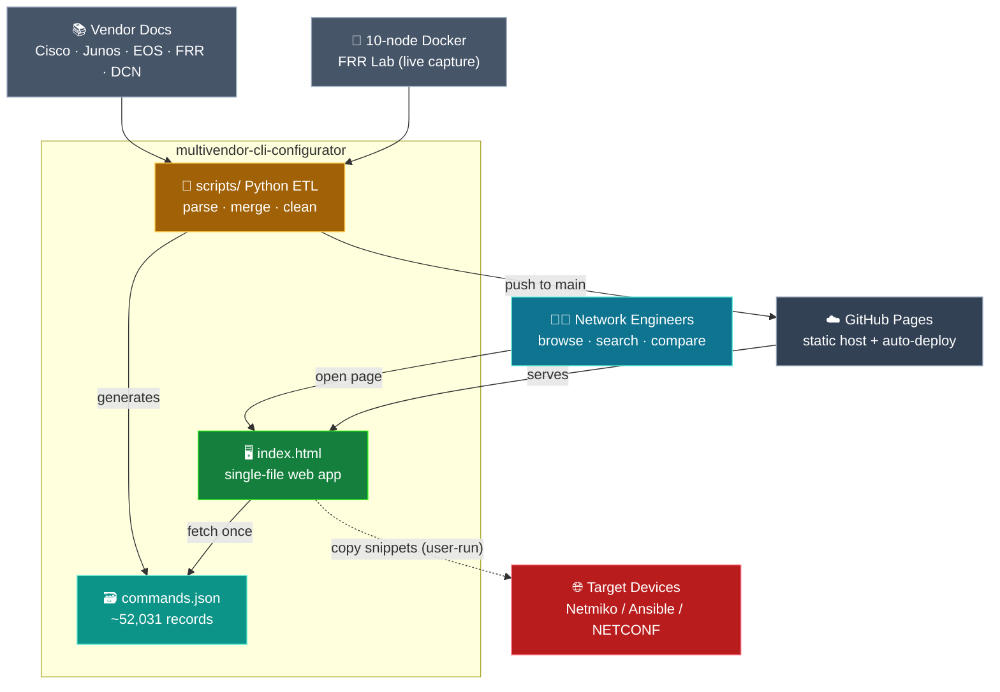
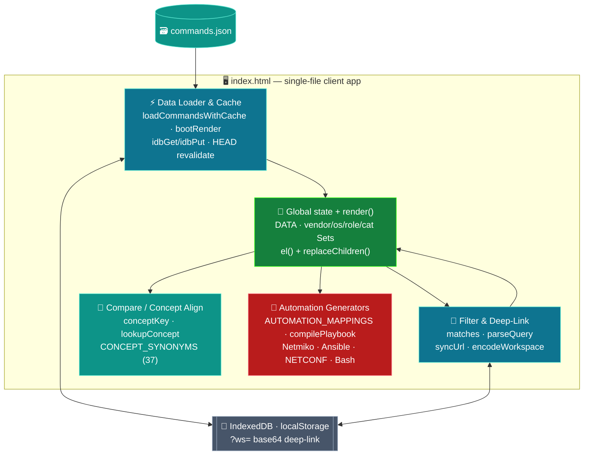
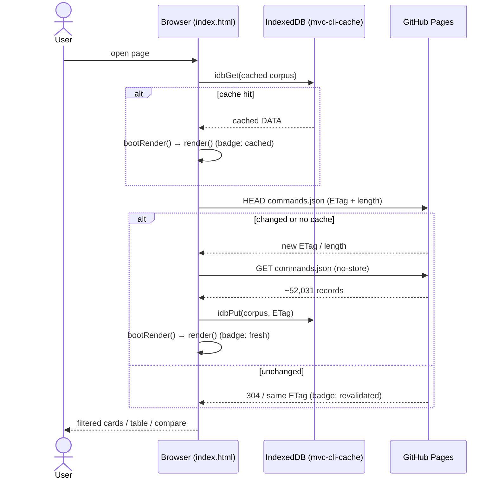
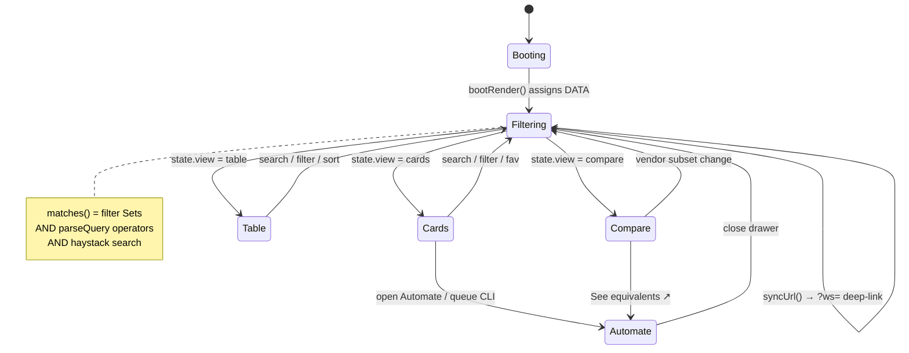
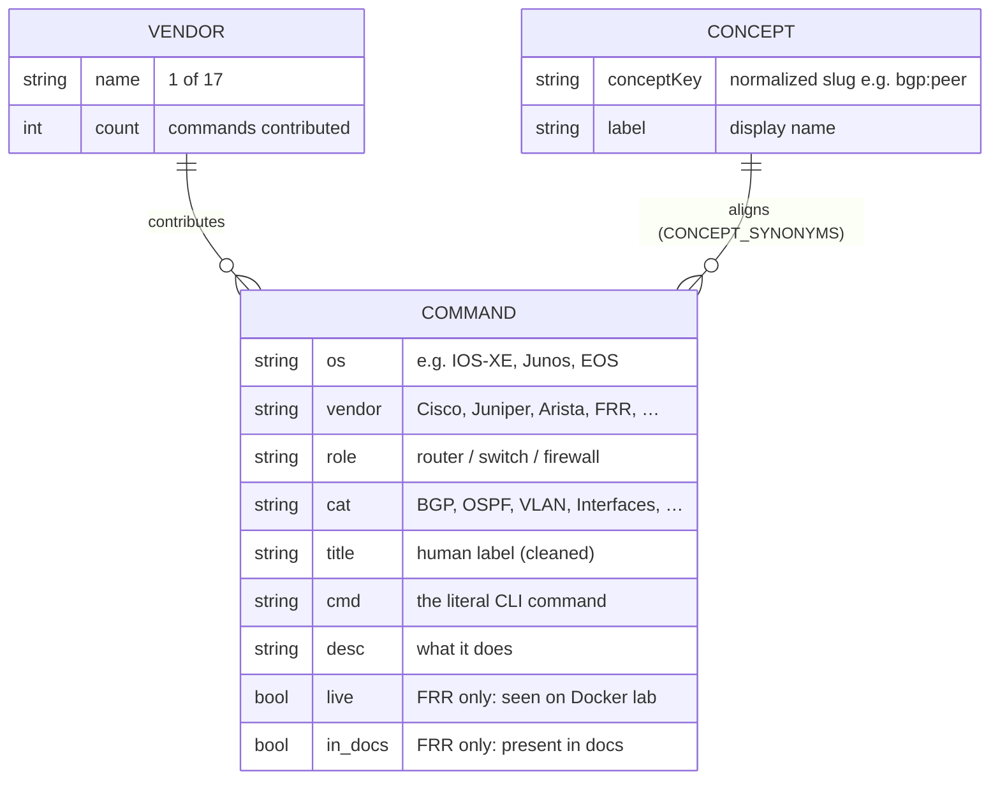

  

# 🏛️ multivendor-cli-configurator — Architecture

A **zero-dependency, single-file HTML cheatsheet** that puts **~52,031 network CLI
commands across 17 vendors & tools** into one searchable, filterable,
deep-linkable browser page. The runtime is one ~5,800-line `index.html` of vanilla
JavaScript that fetches a flat `commands.json` (cache-then-revalidate via IndexedDB)
and renders everything **client-side** in three views — Cards, Table, and Compare —
**with no backend**. A separate offline, **stdlib-only Python pipeline** under
`scripts/` parses published vendor docs into per-source JSON, merges and dedupes them
into `commands.json`, which is committed and auto-deployed via **GitHub Pages**.
Beyond lookup, the UI generates **vendor-correct automation snippets**
(NETCONF / ncclient / Netmiko / Ansible / Bash) by regex-extracting values from each
command.

---

## Table of Contents

1. [System Context](#1-system-context)
2. [Container & Component Map](#2-container--component-map)
3. [Runtime Boot Sequence](#3-runtime-boot-sequence)
4. [Build & Data-Flow Pipeline](#4-build--data-flow-pipeline)
5. [Render-Dispatch State Machine](#5-render-dispatch-state-machine)
6. [Command Data Model](#6-command-data-model)
7. [Tech Stack](#7-tech-stack)

---

## 1. System Context

The whole system is **one static page + one JSON file**. Network engineers interact
with it directly in a browser; published vendor docs and a live FRR lab feed an
offline pipeline; GitHub Pages serves the artifacts; and generated automation snippets
eventually target real devices out-of-band.

---

## 2. Container & Component Map

`index.html` is a monolith by file count but cleanly layered by concern: a boot/cache
layer, a global state + render dispatcher, a filter/deep-link engine, a concept-alignment
compare engine, and an automation/code-generation layer — all over an in-memory `DATA`
array hydrated from `commands.json`.

---

## 3. Runtime Boot Sequence

On load the app renders **instantly from the IndexedDB cache** if present, then
HEAD-revalidates `commands.json` against a stored ETag + Content-Length and only
re-fetches and re-renders when the artifact actually changed — a classic
cache-then-revalidate path that keeps a 17 MB corpus feeling instant.

---

## 4. Build & Data-Flow Pipeline

The offline Python pipeline (never shipped to the browser) turns published vendor
books and a live FRR lab into one deduped JSON array: per-source parsers emit
intermediate JSON, a master merger folds in community markdown + seed + DCN corpus,
and quality utilities repair and quarantine bad rows before the final commit.

```mermaid
flowchart LR
    src["📚 scripts/sources/*<br/>vendor books · docs (gitignored)"]:::source
    parsers["🐍 parse_*.py<br/>encor · junos · arista · frr · cisco · extras"]:::build
    inter["🧩 per-source JSON<br/>encor.json · junos.json · …"]:::build
    master["🔀 parse.py + merge_dcn_corpus.py<br/>merge + dedupe by normalized cmd"]:::accent
    clean["🧹 clean_titles.py + audit_data_quality.py<br/>repair prose · quarantine bad rows"]:::accent
    out[("🗃️ commands.json<br/>~52,031 records")]:::store
    web["🖥️ index.html<br/>fetch() at boot"]:::core

    src --> parsers --> inter --> master --> clean --> out --> web

    classDef source fill:#475569,stroke:#94a3b8,color:#fff
    classDef build  fill:#a16207,stroke:#ffd152,color:#fff
    classDef accent fill:#0d9488,stroke:#5eead4,color:#fff
    classDef store  fill:#0d9488,stroke:#5eead4,color:#fff
    classDef core   fill:#15803d,stroke:#39ff14,color:#fff
```

---

## 5. Render-Dispatch State Machine

Every user action mutates the global `state`, which the `render()` dispatcher reads to
filter `DATA` via `matches()` and route to exactly one of three view renderers. State
is persisted to `localStorage` and serialized into a shareable base64 `?ws=` URL.

---

## 6. Command Data Model

There is **no database** — the entire "schema" is the shape of each record in the flat
`commands.json` array. Records share a common shape; FRR rows add optional provenance
flags, and the Compare engine derives a stable `conceptKey` slug to line up
semantically-equivalent rows across vendors.

---

## 7. Tech Stack

| Layer | Technology |
|---|---|
| **Runtime UI** | Vanilla JavaScript · HTML · CSS — zero framework, zero build, zero JS dependencies |
| **Boot & cache** | Fetch API (HEAD/GET, `cache:'no-store'`) · IndexedDB (`mvc-cli-cache`) |
| **Persistence** | `localStorage` · base64 `?ws=` deep-link URLs |
| **Compare engine** | `conceptKey` slugs · 37-entry `CONCEPT_SYNONYMS` · CSS grid |
| **Automation** | Regex extraction → NETCONF / ncclient / Netmiko / Ansible / Bash via lookup tables |
| **Data pipeline** | Python 3 standard library only (`json`, `pathlib`, `re`) — no third-party deps |
| **Data artifact** | `commands.json` — ~17 MB flat array of ~52,031 records |
| **Hosting / CI** | GitHub Pages — static host, auto-deploy on push to `main` |
| **Tests** | Node.js `assert` + source-extraction testing (`tests/stress_test.js`) |

---

Diagrams render natively on GitHub. Hero banner is a handcrafted animated SVG
(SMIL + CSS keyframes, with a <code>prefers-reduced-motion</code> guard).

